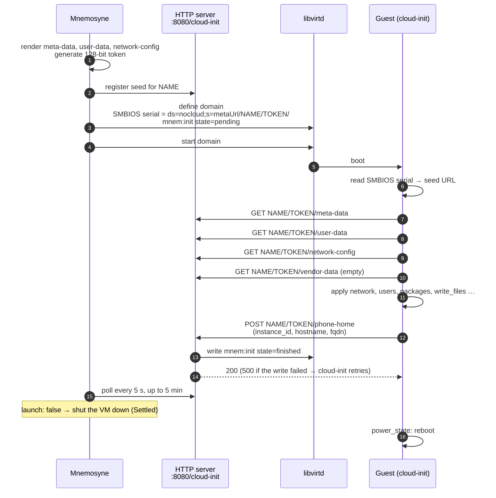
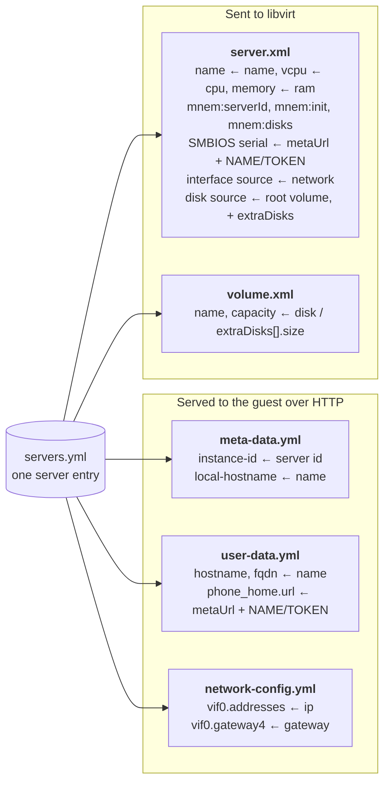
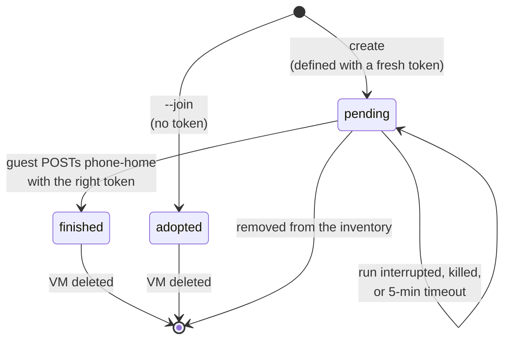

# Cloud-init

[← README](../README.md)

- [How a guest finds its configuration](#how-a-guest-finds-its-configuration)
- [What the guest receives](#what-the-guest-receives)
- [The seed server](#the-seed-server)
- [Initialization marker](#initialization-marker)

A new VM is configured once, on its first boot, by cloud-init's
[NoCloud](https://cloudinit.readthedocs.io/en/latest/reference/datasources/nocloud.html)
datasource. There is no seed ISO: the guest downloads its configuration from Mnemosyne's
built-in HTTP server and reports back when it is done.

## How a guest finds its configuration



The only link between the domain and its configuration is the SMBIOS system serial
`ds=nocloud;s=<metaUrl><name>/<token>/`, set through `<sysinfo>` in `server.xml`. `metaUrl` must
therefore resolve and be reachable **from inside the guest** — typically
`http://<address of the Mnemosyne host>:8080/cloud-init/`.

## What the guest receives

Five templates are rendered per VM (paths in the [`templates` block](configuration.md#templates)).
Mnemosyne fills in only the values it owns; **everything else is passed through as written**.



| Served file | Template | Filled from the inventory | Taken from the template as is |
| --- | --- | --- | --- |
| `meta-data` | [`meta-data.yml`](../templates/meta-data.yml) | `instance-id` ← server id, `local-hostname` ← `name` | `cloud-name` and anything else |
| `user-data` | [`user-data.yml`](../templates/user-data.yml) | `hostname`, `fqdn` ← `name`; `phone_home` (url with the token, `post: [instance_id, hostname, fqdn]`, `tries: 10`) | users and SSH keys, packages, `write_files`, timezone, locale, `power_state` … |
| `network-config` | [`network-config.yml`](../templates/network-config.yml) | `ethernets.vif0.addresses` ← `ip`, `ethernets.vif0.gateway4` ← `gateway` | `match` / `set-name`, `nameservers` |
| `vendor-data` | — | always empty | — |

Consequences worth knowing:

- **SSH keys and users live in `user-data.yml`, not in the inventory.** The shipped file has a
  placeholder key that will not let you log in; put your own public key there before the first
  run. The annotated reference is [`user-data.example.yml`](../templates/user-data.example.yml).
- **`phone_home` is always injected** — do not add your own to the template, it is overwritten.
- **The network interface must be called `vif0`** in the template: that is the key Mnemosyne
  writes the address into. The shipped template matches `enp1*` and renames it to `vif0`
  ([`network-config.example.yml`](../templates/network-config.example.yml)).
- The shipped `user-data` ends with `power_state: reboot`, which is why `server.xml` has
  `on_reboot=restart`. See the comments in [`server.xml`](../templates/server.xml).
- One template set can be shared by all VMs or overridden per group or per server.

## The seed server

- Listens on port **8080**, path **`/cloud-init`**, started only when applying — `--plan` never
  binds the port.
- URLs have the form `/cloud-init/<name>/<token>/<file>`. A request with an unknown name **or** a
  wrong token is answered `404` in both cases, so a guess learns nothing; the token is compared in
  constant time.
- `phone-home` accepts `POST` only (`405` otherwise).
- Only new VMs are registered. Starting an existing VM needs no seed and is never awaited: every
  managed VM has already been through cloud-init.
- The wait polls every 5 seconds for up to 5 minutes. On timeout each missing guest is logged as
  *seed was never fetched* (usually `metaUrl` unreachable from the guest) or *seed fetched, no
  phone_home* (cloud-init ran but did not get to the end).

## Initialization marker

A domain's XML can match the inventory while the VM is still not what the inventory describes,
because cloud-init never finished on it. Mnemosyne records that separately in the domain's
metadata:

```xml
<mnem:init state="finished" token="9f2c…" created="2026-09-25T10:00:03Z" finished="2026-09-25T10:04:41Z"/>
```



- A new domain is defined with `state="pending"` and a random 128-bit token already in its XML,
  so any way a run can end early leaves `pending` behind. The token is also in the SMBIOS serial,
  which inside the guest is readable by root only.
- On `phone_home` Mnemosyne writes `state="finished"` with the time and only then answers `200`;
  if the write fails it answers `500` and cloud-init retries. A `launch: false` VM phones home
  before it is shut down, the same way.
- The next plan lists a `pending` VM as `! … init pending` instead of `no changes`, never updates
  it, and the run — `--plan` included — exits `1`. What to do is the operator's call: remove it
  from the inventory to delete it, or, once the guest is checked, set the state by hand:

  ```bash
  virsh metadata <domain> https://mnemosyne.dev/schema/v1 --config   # inspect
  ```

- `--join` writes `state="adopted"`, without a token: an adopted VM's initialization was never
  Mnemosyne's business.
- A managed VM with **no** marker, or with a state Mnemosyne does not know, is `blocked`: whether
  it was initialized is not guessed. Domains created by versions before the marker existed are in
  this situation — add a marker with `virsh metadata` or recreate them.
- `finished` means cloud-init got as far as `phone_home`, which runs at the end of its final
  stage. It does not mean every module before it succeeded: cloud-init carries on past a failed
  one.
