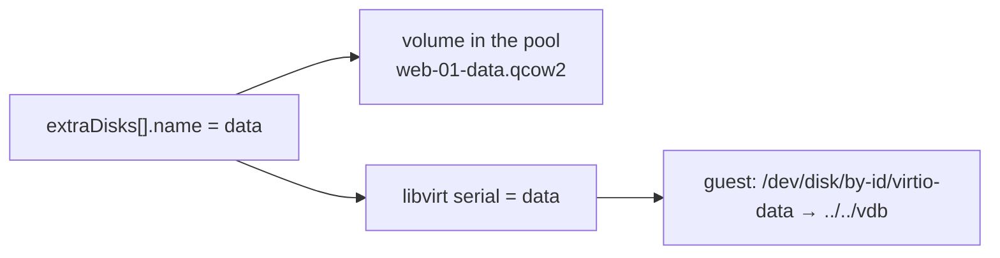
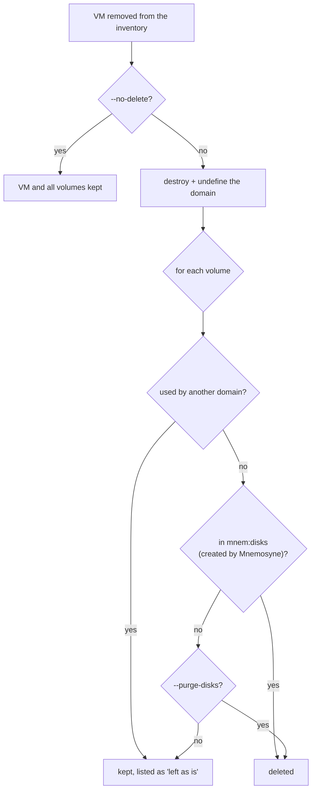

# Disks

[← README](../README.md)

- [Root disk](#root-disk)
- [Extra disks](#extra-disks)
- [What a change in the inventory does](#what-a-change-in-the-inventory-does)
- [Growing a disk](#growing-a-disk)
- [Hot-plug and "applies after power cycle"](#hot-plug-and-applies-after-power-cycle)
- [Reused volumes](#reused-volumes)
- [Deleting a VM](#deleting-a-vm)

The rule behind everything here: **disks are only ever added or grown.** A disk holds the only copy
of whatever is on it, and Mnemosyne cannot tell a disk that is safe to destroy from one that is
not. The one time volumes are deleted is together with their VM.

## Root disk

Cloned from the base image `volLookup` inside the VM's `pool`, then resized to `disk:` GiB. The
volume is named `<name>.qcow2` and described by [`volume.xml`](../templates/volume.xml) (sparse
qcow2).

## Extra disks

```yaml
extraDisks:
  - name: data          # 1-20 chars of a-z, 0-9, '-'; unique within the VM
    size: 40            # GiB, at least 1
  - name: logs
    size: 50
    pool: "fast-ssd"    # optional; defaults to the VM's own pool
```

Blank qcow2 volumes attached after the root disk, at most 24 per VM. They reach the guest
**raw** — partitioning, filesystems and `/etc/fstab` are the administrator's job, and nothing in
Mnemosyne's cloud-init touches them.

Each `name` becomes two things:



- the volume file name, prefixed with the VM's name because a pool's namespace is flat and shared
  by every VM on the host;
- the disk's libvirt `<serial>`, which the guest exposes as `/dev/disk/by-id/virtio-<name>`.

The serial is also how Mnemosyne recognises the disk on later runs, before the file name. That is
what makes renaming a VM through `name:` safe: its disks keep matching, so it is not handed a
second, empty set of them.

**Partition the by-id path, not `/dev/vdb`.** Letters are assigned in the order the disks are
listed, after every target name the domain template already uses, so inserting a disk above an
existing one shifts the letters of the ones below. The by-id path does not move. (Twenty
characters is where virtio truncates the by-id link, hence the name limit.)

An extra disk is a copy of the first `<disk device='disk'>` in [`server.xml`](../templates/server.xml)
with its own source, target and serial, so `bus`, `discard`, `cache` and `io` of the root disk apply
to every data disk. `<boot>`, `<address>` and `<backingStore>` are not copied.

## What a change in the inventory does

| Change | What happens |
| --- | --- |
| New entry under `extraDisks` | Volume created and disk attached — to a new VM and to an existing one. A running guest gets it hot-plugged, or `applies after power cycle` if that fails. |
| Entry removed | **Nothing.** Reported as `not in the inventory - left as is`. Detach it with `virsh detach-disk` and delete the volume yourself if that is what you want. |
| `size` / `disk` increased | The disk is [grown](#growing-a-disk) to exactly the new size. |
| `size` / `disk` decreased | **The run stops.** The VM is `blocked` with both sizes; nothing is applied in any group until the inventory asks for at least the current size. |
| `pool` changed on an existing disk | **Nothing.** Data is never moved between pools. |
| Disk attached by hand | Reported once, never touched — also when the VM is deleted, unless `--purge-disks`. |
| VM removed from the inventory | See [deleting a VM](#deleting-a-vm). |

## Growing a disk

Raise `disk:` or an entry's `size:` and the next run makes the volume that big. It is applied like
any other drift, next to vCPU and RAM; the plan shows it as `grow root disk 25G->40G`.

| The domain is | How | The guest sees it |
| --- | --- | --- |
| running | `virDomainBlockResize` — QEMU grows the image and signals a capacity change on the virtio device | immediately |
| shut down | `virStorageVolResize` on the volume in its pool | at its next boot |

**The partition and filesystem inside the guest are yours.** On a typical Linux guest:
`growpart /dev/vda 1`, then `resize2fs` or `xfs_growfs`. A GPT disk also has its backup header
left mid-device after a grow; `sgdisk -e /dev/vda` fixes it.

## Hot-plug and "applies after power cycle"

A disk attached to a running guest is hot-plugged when possible. If not, it is written to the
persistent config and reported as `applies after power cycle`. libvirt keeps only a small spare of
hot-pluggable PCIe ports, so attaching several disks at once typically places the first and
defers the rest (`No more available PCI slots` in the `-v` log). Nothing is lost.

**Power cycle means stopping and starting the domain**, not rebooting from inside the guest: a
guest reboot keeps the same QEMU process and its devices. Use `launch: false` then `launch: true`,
or `virsh shutdown` + `virsh start`. vCPU and RAM changes reported as `applies after restart`
behave the same way.

## Reused volumes

A volume that already exists under the expected name is **reused, never replaced**: recreating a
VM with the same name gives it its old data disk back, reported as `reused existing volume`. The
same goes for the root disk. Mnemosyne cannot tell such a volume from one it left behind itself, so
it records it as reused (`<mnem:reused-disks>`) rather than created (`<mnem:disks>`), and deleting
the VM leaves it in the pool.

The flip side: a run killed between creating a volume and defining its domain leaves the volume in
the pool, the next run reuses it, and removing it is the operator's call.

A volume already attached to a **different** domain blocks the run outright: two domains sharing
one qcow2 corrupt it as soon as both are running.

## Deleting a VM



Kept without `--purge-disks`: volumes attached by hand, an adopted VM's disks, and reused volumes.
A volume Mnemosyne created but somebody detached from the VM is kept as well. The plan lists every
volume by path before the confirmation window, so nothing disappears unannounced.
