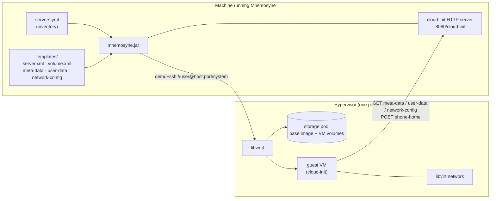
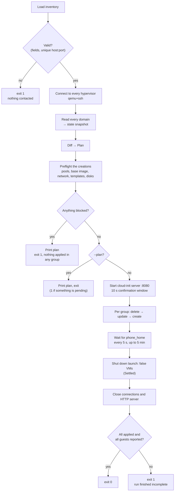
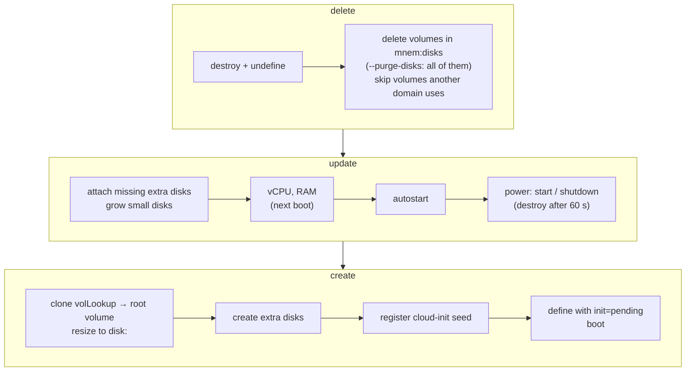

# How it works

[← README](../README.md)

- [Architecture](#architecture)
- [State model](#state-model)
- [A run, step by step](#a-run-step-by-step)
- [The plan](#the-plan)
- [Preflight](#preflight)
- [Applying](#applying)
- [Adopting existing VMs](#adopting-existing-vms)
- [Project layout](#project-layout)

## Architecture



Mnemosyne talks to each hypervisor through libvirt over SSH only; nothing is installed on the
hypervisor. The guests, in turn, talk to Mnemosyne's HTTP server, so `metaUrl` must be reachable
from **inside** the guest.

## State model

| Term | Meaning |
| --- | --- |
| Mnemon | One hypervisor group: a libvirt host plus the map of VMs that belong on it. Top-level item of the inventory. |
| Server | One VM, that is, one libvirt domain. |
| `serverId` | The inventory map key. Written into the domain's metadata, it is the only identity Mnemosyne matches on, so a VM can be renamed (`name:`) without being recreated. |
| managed / unmanaged | A domain is managed when it carries `managedBy: mnemosyne` metadata. Anything else is unmanaged and never touched unless adopted with `--join`. |
| init marker | `<mnem:init state="pending\|finished\|adopted">` — whether a managed VM's one-off cloud-init is known to have finished. See [cloud-init](cloud-init.md#initialization-marker). |
| Plan | The diff between the inventory and the live domains: `create`, `update`, `delete`, plus `pending`, `blocked` and `note` entries. |
| Extra disk | An additional blank disk declared under `extraDisks`. See [disks](disks.md). |

Everything Mnemosyne knows about a domain it keeps in the domain's own XML, under the
`https://mnemosyne.dev/schema/v1` namespace — there is no local state file:

```xml
<metadata>
  <mnem:mnemosyne xmlns:mnem="https://mnemosyne.dev/schema/v1">
    <mnem:managedBy>mnemosyne</mnem:managedBy>
    <mnem:serverId>web-01.example.lan</mnem:serverId>
    <mnem:disks>…</mnem:disks>                <!-- volumes Mnemosyne created: deleted with the VM -->
    <mnem:reused-disks>…</mnem:reused-disks>  <!-- volumes found in the pool: kept -->
    <mnem:init state="finished" token="…" created="…" finished="…"/>
  </mnem:mnemosyne>
</metadata>
```

## A run, step by step



1. **Validate.** The inventory is parsed and checked with Jakarta Bean Validation; an invalid
   field aborts with its path and message. Two groups pointing at the same `host:port` are
   rejected too — each would delete the other's VMs as absent from the inventory. Nothing is
   contacted before this passes.
2. **Connect.** One libvirt connection per group:
   `qemu+ssh://user@host:port/system?keyfile=<key>&no_verify=1&no_tty=1`. The key must be an
   existing file on the machine running Mnemosyne.
3. **Snapshot.** Every domain on the host is read: name, vCPU, RAM, power state, autostart,
   metadata, disks and their capacities.
4. **Plan** — see [below](#the-plan).
5. **Preflight** — see [below](#preflight). With `--plan` the run stops here.
6. **Confirm.** The cloud-init server starts on port 8080 under `/cloud-init`, then a 10-second
   window during which `Ctrl+C` aborts.
7. **Apply** — see [below](#applying).
8. **Wait.** New guests are awaited through cloud-init's `phone_home`, polled every 5 seconds for
   up to 5 minutes ([details](cloud-init.md)). VMs created with `launch: false` are then shut
   down and reported under `Settled`.
9. **Exit code.** `0` only when the host matches the inventory. A skipped entry, a guest that never
   phoned home or a VM left pending by an earlier run makes it `1`
   ([exit codes](configuration.md#exit-codes)).

## The plan

| Entry | When | What happens |
| --- | --- | --- |
| `+` create | In the inventory, no managed domain with that `serverId`, no unmanaged domain with that name | Created |
| `~` update | Managed, and vCPU, RAM, power state or autostart differ, an extra disk is missing, or a disk is smaller than asked | Changed in place |
| `-` delete | Managed, no longer in the inventory | Destroyed with its volumes; suppressed by `--no-delete` |
| `!` pending | Managed, in the inventory, `<mnem:init state="pending">` | Shown, never updated; the run exits `1` |
| `!` blocked | A prerequisite is missing, a disk would shrink, a volume is attached elsewhere, or the init marker is missing/unknown | Nothing is applied in **any** group |
| `i` note | Disk facts Mnemosyne will not act on | Printed only |
| `>` unmanaged | Everything else | Never touched; listed under `--join` |

The exact console format is in [output](output.md).

## Preflight

Everything the planned creations and disk attachments need is checked **before** the plan is
printed, so a plan that cannot work is never started:

- every storage pool exists and is running;
- the pool of a VM being created holds the base image `volLookup` (looked up in libvirt's cache
  first, and the pool refreshed only if it is missing, so a freshly copied image is found);
- the libvirt `network` exists and is running;
- the template files are readable on the machine running Mnemosyne;
- no volume Mnemosyne is about to write to is already attached to a different domain.

Each pool, image and network is looked up once per distinct value, and a group with nothing to
create is not queried at all. A VM that fails any check is listed as `blocked` with the reason,
and one blocked VM stops the whole run. `--join` creates nothing and is not checked.

## Applying

Each group is reconciled in the order **delete → update → create**:



- **create** always boots a new VM once, whatever `launch` says, so cloud-init can configure it;
  a `launch: false` VM is shut down again at the end of the run. A volume that already exists
  under the expected name is reused and recorded as reused, never as created, so it is not
  deleted with the VM ([disks](disks.md#reused-volumes)). A failed creation deletes only the
  volumes it created itself.
- **update** changes vCPU through libvirt and RAM by redefining the persistent config; both take
  effect on the guest's next boot (`applies after restart`). Disk changes are described in
  [disks](disks.md).
- Failures are per VM: the entry is reported as skipped and the run continues.

**Parallelism.** VMs are applied one at a time unless `--parallel <n>`. Each of the three phases
then applies up to `n` VMs at once and finishes before the next begins, so a name freed by a
delete is free before a create asks for it. Groups are still reconciled one after another, and the
output is printed in plan order regardless of which VM finished first. libvirtd serves at most 5
requests per client connection by default (`max_client_requests`), and the real ceiling is usually
the pool's I/O while base images are being cloned.

## Adopting existing VMs

`--join` takes over already-running domains without recreating them. The plan lists the
unmanaged domains; for each one whose name matches an inventory entry Mnemosyne writes the
`mnemosyne` metadata onto the live domain, with `<mnem:init state="adopted">`. Nothing is created,
changed or deleted. Subsequent ordinary runs see those VMs as managed.

## Project layout

```
src/main/java/com/mnemosyne/app/
  Mnemosyne.java              entry point: load, validate, plan, preflight, confirm, apply, wait
  config/Config.java          picocli command-line options
  model/Mnemon.java           hypervisor group; inventory loading and inheritance
  model/Server.java           one VM; XML and cloud-init rendering, validation constraints
  model/ExtraDisk.java        one entry of extraDisks
  model/InitMarker.java       <mnem:init> state, token and timestamps
  model/Templates.java        template paths, group defaults merged with per-server overrides
  model/Plan.java             create/update/delete/adopt/unmanaged diff
  model/Preflight.java        unmet prerequisites of the planned creations, per VM
  model/DomainState.java      snapshot of a live domain
  libvirt/Hypervisor.java     qemu+ssh connection
  libvirt/Harmonia.java       per-group orchestration: plan, preflight, reconcile, join
  libvirt/DomainOps.java      define, boot, destroy, undefine, update, read metadata
  libvirt/StorageOps.java     clone, create, resize and delete volumes; pool and image checks
  libvirt/NetworkOps.java     libvirt network checks
  http/CloudInitServer.java   NoCloud seed server and phone_home tracking
  output/Report.java          plan/preflight/applied console blocks
  utils/XmlUtil.java          domain XML parsing and metadata rewriting
  utils/TargetDev.java        free <target dev> names for extra disks
configs/                      inventory example
templates/                    domain and volume XML, cloud-init YAML
```
